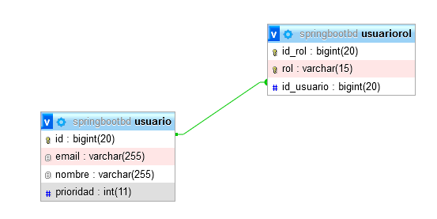

# EjercicioMentoriaSpringBoot
Prueba Postman guardarUsuario clase UsuarioModel:

prueba Postman obtenerUsuarios clase UsuarioModel:

prueba Postman obtenerUsuarioPorId clase UsuarioModel:

prueba Postman obtenerporPrioridad clase UsuarioModel:

prueba Postman eliminarUsuarioporId clase UsuarioModel:

prueba Postman modificarUsuario clase Usuario Model:

Se anexa la imagen donde se muestra el diagrama de clases que se genera desde el servidor donde esta contenida las tablas:

Para mi la relación es de ManytoOne, debido aque 1 Usuario puede tener asignado rol al mismo tiempo, pero un rol puede tener
varios usuarios asignados a la vez.