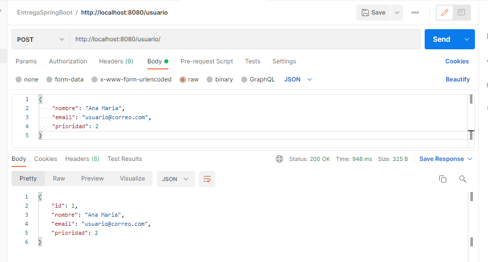
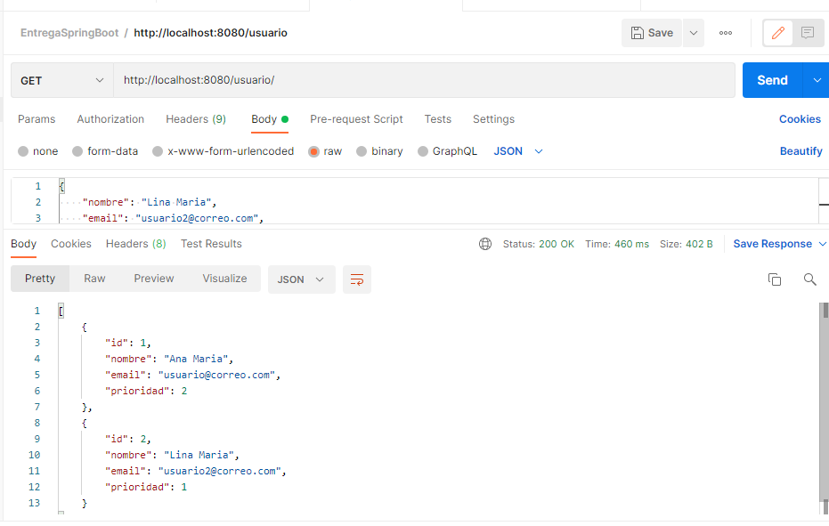
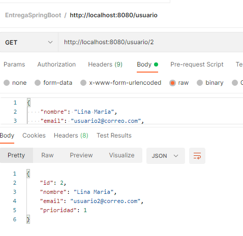
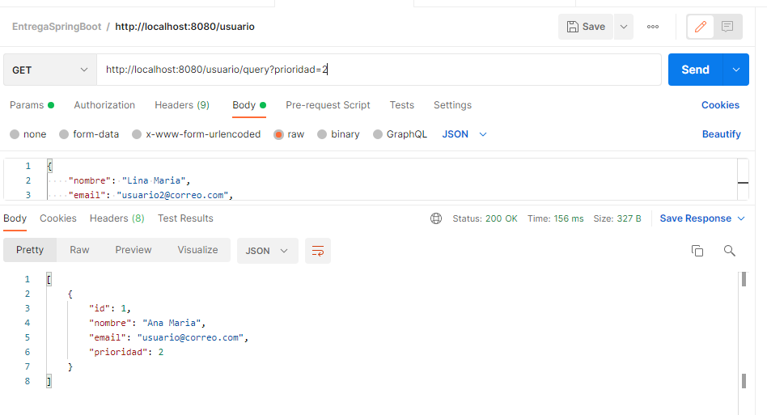
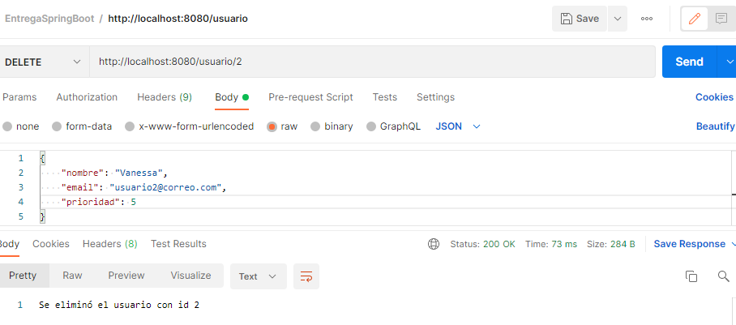
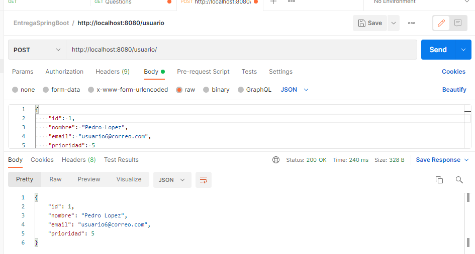

# EjercicioMentoriaSpringBoot
Prueba Postman guardarUsuario clase UsuarioModel:

prueba Postman obtenerUsuarios clase UsuarioModel:

prueba Postman obtenerUsuarioPorId clase UsuarioModel:

prueba Postman obtenerporPrioridad clase UsuarioModel:

prueba Postman eliminarUsuarioporId clase UsuarioModel:

prueba Postman modificarUsuario clase Usuario Model:
